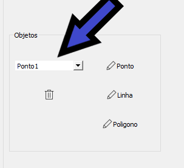

# Trabalho de CG - Arthur Moreira Rodrigues Alves & Bryan Martins Lima
Repositório com os códigos dos trabalhos da disciplina de CG.

### Como executar
Antes de executar o projeto é necessário instalar as dependências do projeto; para isso navegue até o diretório raiz do
projeto e execute o seguinte comando para criar um ambiente virtual:
```
python3 -m venv venv
```
Com o ambiente criado, ative-o:
```
source venv/bin/activate
```
Com o ambiente ativado(você deve ver um ```(venv)``` na frente de seu usuário no terminal), instale os requisitos do
projeto:
```
pip3 install -r requirements.txt
```
Com os requisitos do projeto satisfeitos é possível executá-lo com o seguinte comando:
```
python3 src/main.py
```
Para desativar o ambiente virtual:
```
deactivate
```

### Como usar o programa
Todos os comandos são de certa forma intuitivos, com salva exceção da opção de deletar um objeto
Para deletar um objeto, primeiro selecione ele no ComboBox como mostra na imagem e selecione a Lixeira para deletar o
objeto.



### Informações extras
- O eixo X é desenhado em vermelho; a porção positiva é aquela com tom mais claro;
- O eixo Y é desenhado em azul; a porção positiva é aquela com tom mais claro;
- Por padrão o clipping não é aplicado para linhas e os eixos; isso só ocorre após
  clicar em alguma opção; isso ocorre apenas para mostrar que o clipping funciona;
- A rotação da window ocorre em múltiplos de 10º;

### Links usados para auxílio no desenvolvimento do trabalho
- [Conjunto de vídeos em br sobre PyQt5](https://www.youtube.com/playlist?list=PLwsAoT89dh3qJ8JcprQ8AuHY8AGasvx4G);
- [Tutorial de criação de calculadora com PyQt5](https://realpython.com/python-pyqt-gui-calculator/);
- [Doc de QGraphicsScene](https://doc.qt.io/qtforpython-5/PySide2/QtWidgets/QGraphicsScene.html);
- [Doc de QGraphicsView](https://doc.qt.io/qtforpython-5/PySide2/QtWidgets/QGraphicsView.html);
- [Exemplo 1 de uso do QGraphicScene](https://www.youtube.com/watch?v=naHtXpCiPuM);
- [Exemplo 2 de uso do QGraphicScene](https://www.youtube.com/watch?v=IKqkOI_o6_A);
- [Exemplo 3 de uso do QGraphicScene](https://www.youtube.com/watch?v=RO_x6ueITHQ);
